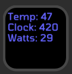

# Trevor's Stream Deck Plugin in Rust

This is a Stream Deck plugin written in Rust.

* Currently works on Windows 11
* Currently tested with a single NVIDIA GPU

# Usage

Copy the contents of this directory to `%APPDATA%\Elgato\Stream Deck\plugins\net.trevorsullivan.trevor.sdPlugin\`.

Make sure you have the [Rust toolchain installed](https://rustup.rs).
If you make any code changes, run this command:

```
cargo build; Copy-Item .\target\debug\streamdeck-rust.exe .
```

# Icons

Currently this project supports a single custom icon in the plugin called "NVIDIA GPU Info."

